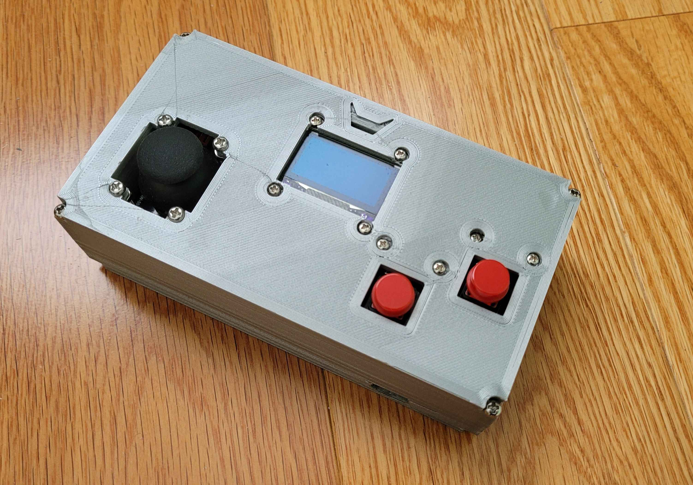

# Controle Retrô 

Controle retrô desenvolvido para recriar a experiência dos fliperamas e consoles clássicos. Sua estrutura é impressa em 3D FDM com PETG.

O dispositivo conta com **1 joystick arcade** e **2 botões mecânicos**, conectados via **USB plug-and-play**.
O funcionamento é gerenciado por um **ESP32 programado em C++**, possibilitando compatibilidade com emuladores e sistemas retrô.

## Materiais / Estrutura
- Estrutura impressa em 3D (PETG)  
- Joystick arcade  
- 2 botões arcade mecânicos  
- ESP32 (microcontrolador)  
- OLED display 
- Cabo USB  
- Parafusos e suportes para montagem

