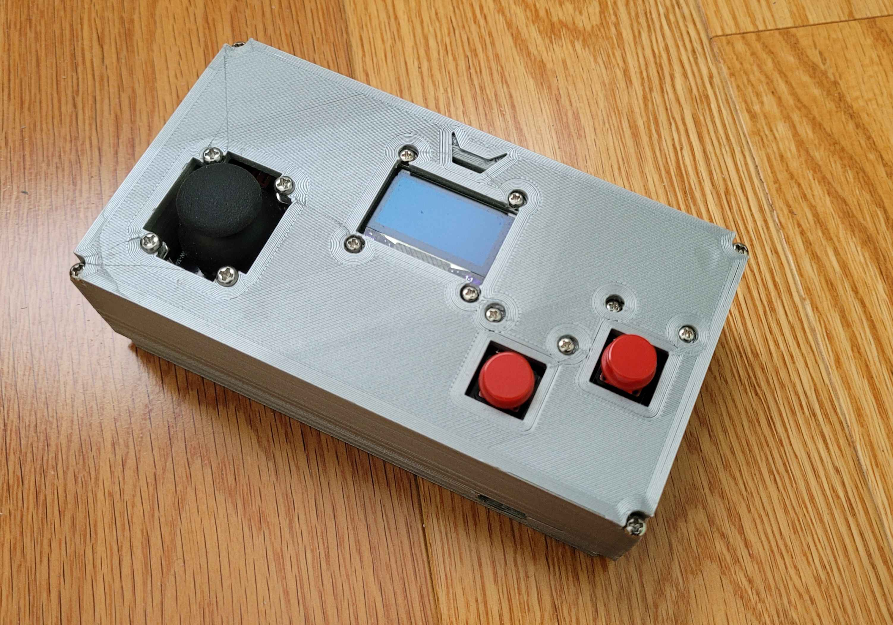

# Controle Retrô 

Projeto de controle retrô para fliperamas e consoles clássicos. Estrutura impressa em 3D, acabamento liso e base antiderrapante. Equipado com **1 joystick** de alta precisão e **2 botões arcade mecânicos**, conectados via USB plug-and-play. Inclui código em C++ para integração com sistemas e emuladores retrô.

## Materiais / Estrutura
- Estrutura impressa em 3D (PETG)  
- Joystick arcade  
- 2 botões arcade mecânicos  
- ESP32 (microcontrolador)  
- OLED display 
- Cabo USB  
- Parafusos e suportes para montagem

